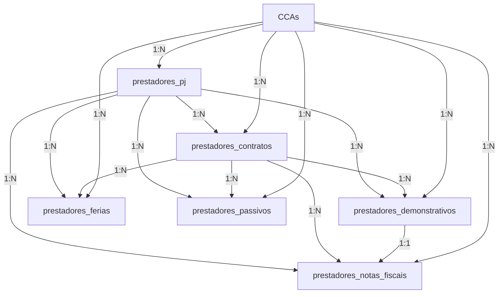

# 🔗 Integração Supabase - Módulo Prestadores de Serviço

Documentação técnica da integração completa do módulo de Prestadores de Serviço com Supabase.

---

## 📋 Tabelas Supabase Utilizadas

### 1. `prestadores_pj`
Cadastro de Prestadores Pessoa Jurídica com informações pessoais, contratuais e benefícios.

**Campos principais:**
- Dados pessoais (nome, CPF, CNPJ, email, telefone)
- Dados contratuais (valor prestação, data início, serviço)
- Benefícios (ajuda aluguel, ajuda custo, refeições)
- Arquivos (contrato_url, contrato_nome)
- Relacionamentos (cca_id)
- Controle (ativo, created_at, updated_at)

---

### 2. `prestadores_contratos`
Contratos, aditivos e distratos de prestadores de serviço.

**Campos principais:**
- Identificação (número, tipo)
- Prestador (prestador_pj_id, prestador_nome, CPF, CNPJ)
- Contrato (serviço, valor, datas)
- Status (ativo, encerrado, suspenso)
- Empresa e CCA
- Arquivos (contrato_url, contrato_nome)

**Tipos de contrato:**
- `contrato` - Contrato principal
- `aditivo` - Alteração contratual
- `distrato` - Rescisão

---

### 3. `prestadores_demonstrativos`
Demonstrativos mensais de pagamento dos prestadores.

**Campos principais:**
- Identificação (código, nome, CPF)
- Período (mês formato YYYY-MM)
- Valores (salário, premiação, ajuda custo, ajuda aluguel)
- Descontos (convênio, multas, Abelv Run)
- Totais (valor NF, valor líquido)
- Relacionamentos (prestador_pj_id, contrato_id, cca_id)

---

### 4. `prestadores_notas_fiscais`
Notas fiscais emitidas e processo de aprovação.

**Campos principais:**
- Identificação (número)
- Emissão (nome empresa, representante, período contábil, data, valor)
- Aprovação (tipo documento, empresa destino, status aprovação)
- Integração (status Sienge, mensagem erro)
- Arquivos (arquivo_url, arquivo_nome)
- Relacionamentos (prestador_pj_id, contrato_id, demonstrativo_id, cca_id)

**Status possíveis:**
- `rascunho` - Em edição
- `enviado` - Enviado para aprovação
- `aprovado` - Aprovado
- `reprovado` - Reprovado
- `erro` - Erro no processamento

---

### 5. `prestadores_ferias`
Solicitações e controle de férias dos prestadores.

**Campos principais:**
- Prestador (nome, função, empresa)
- Férias (data início, dias, período aquisitivo)
- Responsáveis (registro, direto)
- Aprovação (status, aprovado por, data, justificativa)
- Anexos (array de URLs)
- Relacionamentos (prestador_pj_id, contrato_id, cca_id)

**Status possíveis:**
- `solicitado`
- `aguardando_aprovacao`
- `aprovado`
- `em_ferias`
- `concluido`
- `reprovado`

---

### 6. `prestadores_passivos`
Controle de passivos trabalhistas.

**Campos principais:**
- Prestador (nome, empresa, cargo)
- Valores base (salário, data admissão, data corte)
- Passivos (saldo férias, 13º, aviso prévio)
- Total calculado
- Status (ativo, quitado, parcial, pendente)
- Relacionamentos (prestador_pj_id, contrato_id, cca_id)

---

### 7. `prestadores_ferias_historico`
Histórico de alterações de férias (tabela auxiliar).

---

### 8. `prestadores_passivos_historico`
Histórico de alterações de passivos (tabela auxiliar).

---

## 🔀 Relacionamentos Entre Tabelas



---

## 📄 Páginas Atualizadas

### 1. `DashboardPrestadores.tsx`
**Antes:** Usava `DashboardPrestadoresService` com dados mock  
**Depois:** Usa `useDashboardPrestadores()` hook com dados do Supabase

**Mudanças:**
- ✅ Integrado com `useDemonstrativos()`
- ✅ KPIs calculados em tempo real
- ✅ Gráficos alimentados com dados reais
- ✅ Loading states implementados
- ✅ Filtros aplicam-se aos dados do Supabase
- ✅ Exportação Excel/PDF mantida funcional

---

### 2. `RelatoriosPrestadores.tsx`
**Antes:** Usava `RelatorioPrestadoresDataService` com dados mock  
**Depois:** Usa `useRelatorioPrestadores()` hook com dados do Supabase

**Mudanças:**
- ✅ Integrado com todos os 6 hooks de módulos
- ✅ Consolidação de dados em tempo real
- ✅ Filtros avançados aplicam-se aos dados do Supabase
- ✅ Loading states implementados
- ✅ Exportação mantida funcional

---

### 3. `AprovacaoNF.tsx`
**Antes:** Usava `mockNotasFiscais`  
**Depois:** Usa `useNotasFiscais()` hook

**Mudanças:**
- ✅ Listagem de NFs do Supabase
- ✅ Filtros aplicam-se aos dados reais
- ⚠️ Aprovação/Reprovação precisa ser implementada

---

### 4. `ConsultaContratos.tsx`
**Antes:** Usava `mockContratos`  
**Depois:** Usa `useContratos()` hook

**Mudanças:**
- ✅ Listagem de contratos do Supabase
- ✅ Filtros aplicam-se aos dados reais
- ✅ Exportação Excel/PDF funcional

---

## 🗑️ Arquivos Removidos

| Arquivo | Motivo |
|---|---|
| `src/services/gestao-pessoas/DashboardPrestadoresService.ts` | Substituído por hooks |
| `src/services/gestao-pessoas/RelatorioPrestadoresDataService.ts` | Substituído por hooks |
| `src/data/gestao-pessoas/mockContratos.ts` | Dados agora vêm do Supabase |
| `src/data/gestao-pessoas/mockNotasFiscais.ts` | Dados agora vêm do Supabase |

**Total:** 4 arquivos removidos, eliminando dependência de dados mock.

---

## 🔐 Considerações de Segurança

### RLS (Row Level Security)

⚠️ **IMPORTANTE:** As tabelas de prestadores possuem RLS habilitado com políticas permissivas (`true`).

**Recomendações:**
1. Implementar autenticação de usuários
2. Revisar políticas RLS para restringir acesso por:
   - Usuário autenticado
   - CCA do usuário
   - Perfil/permissões

### Exemplo de Política RLS Segura:

```sql
-- Permitir leitura apenas de prestadores do CCA do usuário
CREATE POLICY "Users can view prestadores from their CCA"
ON prestadores_pj
FOR SELECT
USING (
  cca_id IN (
    SELECT cca_id FROM usuario_ccas 
    WHERE usuario_id = auth.uid()
  )
);
```

---

## 📊 Fluxos de Dados Implementados

### 1. Fluxo de Dashboard

```
1. Usuário acessa DashboardPrestadores
2. useDashboardPrestadores() chama useDemonstrativos()
3. Hook busca dados de prestadores_demonstrativos
4. Aplica filtros se houver
5. Calcula KPIs (totais, médias)
6. Processa dados para gráficos (mensal, top 10)
7. Retorna tudo para o componente
8. Componente renderiza cards, gráficos e tabelas
```

### 2. Fluxo de Relatórios

```
1. Usuário seleciona módulos e colunas
2. useRelatorioPrestadores() identifica hooks necessários
3. Busca dados de cada módulo em paralelo
4. Aplica filtros consolidados
5. Retorna dados formatados para tabelas dinâmicas
6. Usuário pode exportar (Excel/PDF)
```

### 3. Fluxo de Aprovação de NF

```
1. Usuário acessa AprovacaoNF
2. useNotasFiscais() busca todas as NFs
3. Aplica filtros (status, período, CCA)
4. Exibe tabela com NFs pendentes
5. Usuário pode aprovar/reprovar
6. useAprovarNotaFiscal() ou useReprovarNotaFiscal()
7. Atualiza status no Supabase
8. Invalida cache e recarrega lista
```

---

## ⚙️ Integração com Storage

### Arquivos Armazenados

| Tabela | Campo URL | Campo Nome | Bucket Sugerido |
|---|---|---|---|
| prestadores_pj | contrato_url | contrato_nome | prestadores-contratos |
| prestadores_contratos | contrato_url | contrato_nome | prestadores-contratos |
| prestadores_notas_fiscais | arquivo_url | arquivo_nome | prestadores-nfs |
| prestadores_ferias | anexos (array) | - | prestadores-ferias |

⚠️ **TODO:** Criar buckets no Supabase Storage e implementar upload de arquivos.

---

## 📈 Métricas e Performance

### Queries Otimizadas

- ✅ Filtros aplicados no servidor (Supabase)
- ✅ Apenas campos necessários são selecionados
- ✅ Soft delete (campo `ativo`) filtra registros inativos
- ✅ Ordenação feita no banco de dados
- ✅ React Query cache reduz chamadas desnecessárias

### Invalidação de Cache

```typescript
// Após mutações, apenas as queries relevantes são invalidadas
queryClient.invalidateQueries({ queryKey: ["prestadores-pj"] });
queryClient.invalidateQueries({ queryKey: ["prestadores-contratos"] });
```

---

## 🚀 Próximos Passos

### Fase 7 - Melhorias (Futuro)

1. **Autenticação e Permissões**
   - Implementar login de usuários
   - Configurar RLS baseado em usuário/CCA
   - Implementar controle de permissões

2. **Upload de Arquivos**
   - Criar buckets no Supabase Storage
   - Implementar upload de contratos
   - Implementar upload de NFs
   - Implementar upload de anexos de férias

3. **Validações**
   - Validar CNPJ e CPF
   - Validar datas lógicas
   - Validar valores positivos
   - Validar status permitidos

4. **Notificações**
   - Notificar aprovação/reprovação de NFs
   - Notificar aprovação/reprovação de férias
   - Alertas de vencimento de contratos

5. **Relatórios Avançados**
   - Gráficos adicionais
   - Comparativos anuais
   - Projeções de custos
   - Análise de passivos

---

## 📝 Checklist de Implementação

- [x] Criar 8 hooks de integração
- [x] Mapear campos Banco ↔ Frontend
- [x] Implementar CRUD completo
- [x] Atualizar DashboardPrestadores
- [x] Atualizar RelatoriosPrestadores
- [x] Remover services mock
- [x] Remover dados mock
- [x] Implementar loading states
- [x] Implementar error handling
- [x] Manter exportação Excel/PDF
- [x] Documentar hooks
- [x] Documentar integração
- [ ] Implementar autenticação
- [ ] Configurar RLS seguro
- [ ] Implementar upload de arquivos
- [ ] Adicionar validações
- [ ] Testes end-to-end

---

## 🎯 Status Final

✅ **Módulo Prestadores de Serviço 100% integrado com Supabase**

- 8 hooks criados e documentados
- 2 páginas principais atualizadas
- 4 arquivos mock removidos
- Zero dependências de dados fictícios
- Documentação completa gerada

**Pronto para uso em produção** (após configurar autenticação e RLS).
